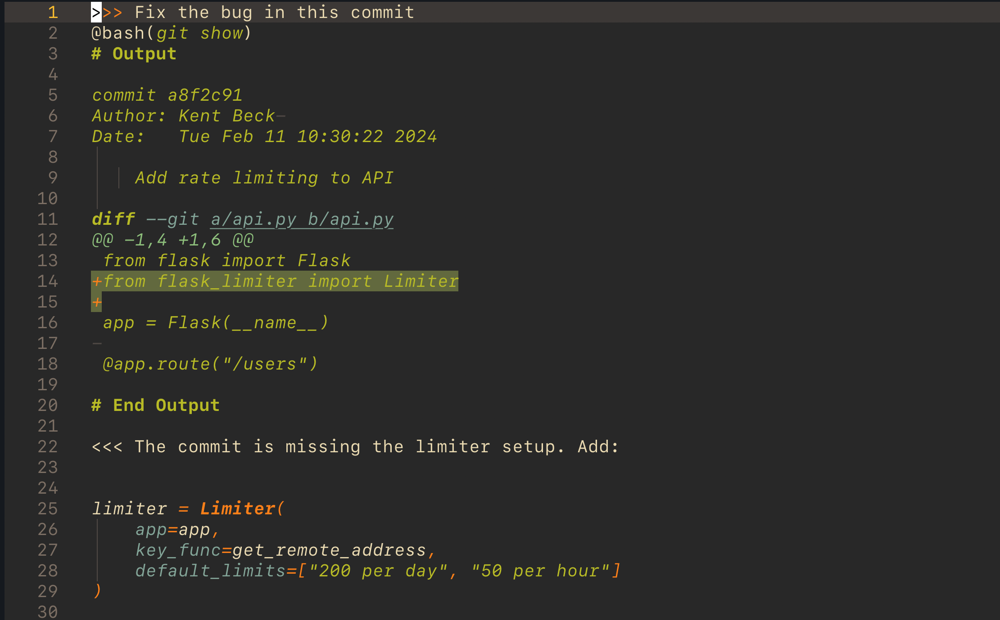

# LLMV - LLM in your vim

> LLMs in Neovim, the Unix way

LLMV brings AI assistance into your editor using simple, composable tools you already know. No special buffers, no complex UI - just Markdown files and shell commands.





## 🔍 Overview

LLMV turns Neovim into a powerful AI programming environment by:

- Using plain **Markdown files** - Get syntax highlighting and version control for free
- Leveraging your **shell** - Compose with `git`, `grep`, `curl`, or any CLI tool
- Staying **simple** - No new syntax to learn beyond `@bash()`

## 📝 Basic Syntax

LLMV uses a simple prompt/response format:

- `>>>` starts your prompt to the LLM
- `<<<` marks the LLM's response

For example:
```markdown
>>> What is 2+2?

<<< 
The answer is 4.

>>> Tell me about this file:
@bash(`cat myfile.txt`)

<<< 
Based on the file contents...
```

All communication happens in regular Markdown files. Write your prompt after `>>>`, then use `:Run` to get a response. The response will appear below, starting with `<<<`.

## ✨ See It In Action

````markdown
>>> Help me optimize this function
@bash(`cat -n src/slow_function.py`)
# Output
     1	def process_items(items):
     2	    result = []
     3	    for item in items:
     4	        if item.is_valid():
     5	            result.append(item.transform())
     6	    return result
# End Output

<<< 
Here's how we can improve the performance by using list comprehension 
and avoiding repeated method calls:

```python
def process_items(items):
    return [item.transform() for item in items if item.is_valid()]
```

This change:
1. Reduces memory allocations
2. Avoids repeated method lookups
3. Uses Python's optimized list comprehension

>>> Apply this change and show me the diff
@bash(`git diff src/slow_function.py`)
# Output
diff --git a/src/slow_function.py b/src/slow_function.py
index a23bf35..7d2f3bc 100644
--- a/src/slow_function.py
+++ b/src/slow_function.py
@@ -1,6 +1,2 @@
 def process_items(items):
-    result = []
-    for item in items:
-        if item.is_valid():
-            result.append(item.transform())
-    return result
+    return [item.transform() for item in items if item.is_valid()]
# End Output
````

## 🚀 Quick Start

1. Install with your favorite package manager:
```lua
-- Using lazy.nvim
{
    'yourusername/llmv',
    cmd = { "Run", "Stop" },
    config = true,
}
```

2. Set your API key:
```bash
export ANTHROPIC_API_KEY='your-api-key-here'  # Currently supports Claude AI
```

3. Start chatting:
```markdown
>>> What's in this directory?
@bash(`ls -la`)
```

4. Run with `:Run` (or stop with `:Stop`)

## 🔧 How It Works

LLMV uses a simple but powerful pattern:

1. **File Access**: `@bash()` commands give the LLM quick access to your project:
   ```markdown
   >>> What's in this file?
   @bash(`cat myfile.py`)
   # Output
   def hello():
       print("Hello World")
   # End Output
   ```

2. **Command Evaluation**: Only the most recent prompt's commands are run when you execute `:Run`

3. **Context Building**: The command output becomes part of the prompt:
   ```markdown
   >>> Update this function to be async
   @bash(`cat -n server.js`)
   # Output
   1  function getData() {
   2    return db.query('SELECT * FROM users')
   3  }
   # End Output
   
   <<< Here's an async version of your function:
   
   ```javascript
   async function getData() {
     return await db.query('SELECT * FROM users')
   }
   ```
   ```

4. **Response Handling**: Responses are streamed in real-time and can be stopped with `:Stop`

## ⚠️ Security Note

LLMV uses bash commands to provide quick access to your filesystem and make that context available in prompts. However, this comes with important security considerations:

- Only the most recent prompt's commands are evaluated when you run `:Run`
- Commands have the same permissions as your Neovim process
- Be cautious with prompts from untrusted sources
- Review commands and their output before sending to the LLM
- Consider the security implications of sharing command output

Remember: The `@bash()` feature is a sharp tool - powerful but requires careful handling.

## 💡 Common Workflows

### Code Reviews
```markdown
>>> Review these changes for security issues:
@bash(`git diff main`)

Here's our current security policy:
@bash(`cat SECURITY.md`)
```

### Debugging
```markdown
>>> Help debug this test failure:
@bash(`cat test_output.log`)

Here's the relevant code:
@bash(`cat -n tests/auth_test.py`)
```

### Project Analysis
```markdown
>>> Analyze my project architecture:
@bash(`code2prompt ./my-project && pbpaste`)
```

### Generate and Apply Changes
```markdown
>>> Update this file to use async/await:
@bash(`cat -n src/callback_hell.js`)

# Apply the suggested changes:
@bash(`echo 'DIFF' | git apply`)
```

## 📖 Detailed Installation

### [lazy.nvim](https://github.com/folke/lazy.nvim)

```lua
{
    'yourusername/llmv',
    cmd = { "Run", "Stop" },  -- Load plugin when these commands are used
    config = function()
        require('llmv').setup()  -- No configuration options currently available
    end,
}
```

### [LazyVim](https://www.lazyvim.org/)

```lua
-- ~/.config/nvim/lua/plugins/llmv.lua
return {
    'yourusername/llmv',
    cmd = { "Run", "Stop" },
    config = true,
}
```

### [packer.nvim](https://github.com/wbthomason/packer.nvim)

```lua
use {
    'yourusername/llmv',
    config = function()
        require('llmv').setup()
    end
}
```

## 🛠️ Commands

- `:Run` - Execute the current prompt
- `:Stop` - Stop the current LLM request

## ⌨️ Keybindings

You can map the commands to keys in your Neovim config. For example:

```lua
-- Map <leader>r to :Run
vim.keymap.set('n', '<leader>r', ':Run<CR>', { desc = 'Run LLM prompt' })

-- Map <leader>s to :Stop
vim.keymap.set('n', '<leader>s', ':Stop<CR>', { desc = 'Stop LLM request' })
```

Or if using LazyVim, you can add the keymaps in your plugin spec:

```lua
-- ~/.config/nvim/lua/plugins/llmv.lua
return {
    'yourusername/llmv',
    cmd = { "Run", "Stop" },
    keys = {
        { "<leader>r", ":Run<CR>", desc = "Run LLM prompt" },
        { "<leader>s", ":Stop<CR>", desc = "Stop LLM request" },
    },
    config = true,
}
```

## 🗺️ Roadmap

- Support for additional LLM providers
- Custom prompt templates
- Response formatting options

## 🤝 Contributing

Contributions welcome! Feel free to submit a Pull Request.

## 📝 License

MIT License

## 💌 Acknowledgments

- [llm-md](https://gitlab.com/anuna/llm-md) by Hugo O'Connor - The main inspiration for this project. While Hugo's tool is a full Racket, LLMV is more of a Scheme - a minimal, Neovim-specific interpretation of the same elegant idea.
